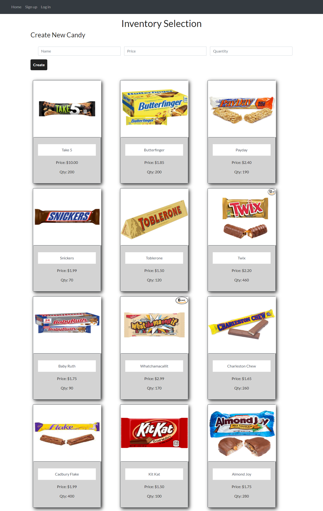

# Candy-Shop-Inventory

This repo houses the assets used to build Candy Shop Inventory, availabe at: https://candy-shop-e-commerce.herokuapp.com/

## Description

Candy Shop Inventory is an inventory management application. A user can sign up with their email and log in to manage the inventory. It has a databse of price, quantity, and products of canides and a user can create, update and delete the data in the application.

## Screenshot

## Questions

https://github.com/CMahoney12/Candy-Shop-Inventory
